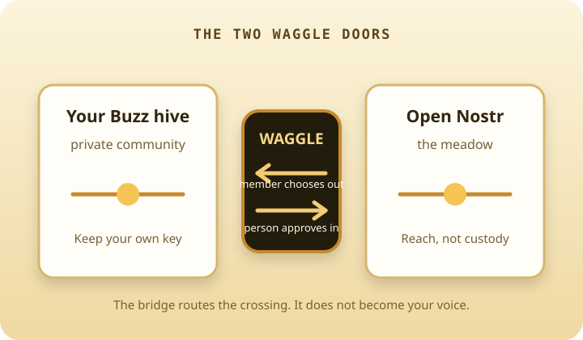

<h1 align="center">waggle 🐝</h1>

<p align="center">
  <strong>Bring the meadow to your hive.</strong>
</p>

<p align="center">
  A non-custodial, quarantine-gated bridge between a private <a href="https://block.github.io/buzz/">Buzz</a> community and the open Nostr network.
</p>

<p align="center">
  <a href="https://waggle.nave.pub">Website</a> ·
  <a href="docs/GETTING_STARTED.md">Set up a hive</a> ·
  <a href="docs/AGENT_PARTICIPANT_ARCHITECTURE.md">Agent architecture</a> ·
  <a href="docs/REVIEW_PACKET.md">Review packet</a> ·
  <a href="docs/SPEC_EXTERNAL.md">Specification</a> ·
  <a href="SECURITY.md">Security</a> ·
  <a href="LICENSE">MIT</a>
</p>

<p align="center">
  
</p>

<p align="center">
  <sub><em>A returning forager carries a bearing home; the hive decides what passes the door.</em></sub>
</p>

---

## What is this, really?

Waggle lets a private community meet the open network on its own terms. One dedicated bridge agent carries traffic across the boundary, while people keep their own identities and the community keeps its walls.

Members can federate an opted-in post outward under their own Nostr keys. Replies and outside messages come back to a door that is closed by default: a person admits what belongs in the room. Sealed direct and group traffic is carried, never opened.

The bridge uses only its own operational identities—its Buzz poster and Nostr transport identity—and never holds a member’s key. The Nostr identity can sign and decrypt through a NIP-46 bunker; Buzz posting still uses the dedicated local CLI key. That makes the bridge a route with a narrow, visible job, rather than a proxy for everyone’s voice.

---

## Stuff you do in Waggle

- **Take a conversation public without becoming a bot.** A member chooses a post, and it is published under that member’s own key.
- **Invite the outside world without opening an inbox.** Public replies land in a default-closed quarantine until a human releases them.
- **Work with an outside agent as a participant.** A signed, revocable grant admits a specific identity; revoking it takes effect without a restart.
- **Bring selected voices home.** A consented feed can enter the community, where people can read it without leaving the room.
- **Reach an admitted guest from inside.** A mention can return as a sealed DM even when the guest cannot read the private community relay.

---

## A look inside

<table>
  <tr>
    <td width="62%" valign="top">
      <br>
      <sub><strong>The meadow meets the hive.</strong> A warm front door for a system with firm boundaries.</sub>
    </td>
    <td width="38%" valign="top">
      <br>
      <sub><strong>Two doors, two decisions.</strong> Members choose what goes out; people choose what comes in.</sub>
    </td>
  </tr>
</table>

---

## How it works

| Lane | Direction | Boundary |
|---|---|---|
| **Out door** | community → open Nostr | The member opts in; the note is signed by that member, not the bridge. |
| **In door** | open Nostr → community | The bridge quarantines first; a human explicitly releases what enters. |
| **Return lane** | community → admitted guest | The bridge delivers a sealed mention to the guest’s external key. |
| **Sealed lanes** | both directions | The bridge routes NIP-17/NIP-59 and Concord traffic without decrypting it. |

<p align="center">
  
</p>

---

## Why Waggle is different

Most bridges make a private community open, make a bot speak for its members, or ask a service to hold everyone’s keys. Waggle does none of those.

One boundary, dedicated bridge identities, and evidence that matches the action: signed grants and public control state, plus durable delivery and operational records. Members author outward posts themselves; where Buzz requires a bridge-authored carrier or repost, Waggle preserves and verifies the source provenance rather than pretending the carrier is the speaker. Admission is explicit, signed, and revocable. The safety story is deliberately operational: narrow custody, observable crossings, durable delivery records, and re-mintable bridge identities.

---

## What is actually true today

| ✅ Works today | 🚧 Being wired up | 💭 Strong opinions, pending code |
|---|---|---|
| Member-signed outward federation and cold read-back | Broader live wake and delivery proof coverage | Native foreign-signed rendering inside Buzz |
| Default-closed inbound quarantine and signed browser/in-channel moderation | More packaged deployment paths | A world where every bridge defaults to human choice |
| Signed, revocable participant grants | Additional operational consoles | |
| Return-leg sealed delivery to admitted guests | | |
| Consent-gated feed following and tripwire detection | | |

<sub>“Works today” means exercised against the real exported functions and verified by read-back where a relay is involved. It does not mean a relay’s acceptance alone.</sub>

---

## Getting started

```sh
git clone https://github.com/JAFairweather/waggle && cd waggle
npm ci
node tools/waggle-init.mjs
npm test
```

`waggle-init --check` reports readiness without changing anything. Each hive receives a stable,
non-secret installation state that is the shared contract for CLI and Console Setup; `--receipt` exports its
evidence without credentials. The full guided walkthrough is in **[Getting started](docs/GETTING_STARTED.md)**.

The setup intentionally never asks an agent to supply its own key, and never accepts a secret as a command argument.

---

## Tests

`npm test` runs 67 suites against real exported functions with synthetic events—no production state and no network sockets. The suite is designed to prove what the bridge refuses as carefully as what it delivers:

boot · install state · suite roster · off-box policy protocol · standing trusted-reply policy · policy receipt verification · derive-only shadow client · shadow-mode gate · policy journal · policy-owned Buzz artifacts · off-box policy service · policy request queue · remote-only policy gate · forced-command policy runner · policy-host deployment · Nostr remote signer · read resilience · egress catalogue · egress ban · durable dedup store · relay fan-out · quarantine gating · deletion propagation · sealed-lane rate caps · grant admission · admission return-lane lifecycle · message rendering · deployed-build verification · routing-policy snapshot · latency trace · return lane · return-lane scan · typed channel task carry · return-lane no-miss · return-lane pending · relay ingress · tripwire union · tripwire detection drill · deploy runner · console Host check · undelivered record · console pending requests · in-door consent · consent-request template · consent gate · consent ask · recipient DM relays · DM relay-list publisher · watchlist hot-reload · signed owner control state · signed trust tiers · trust-gradient lane vocabulary · agent lifecycle catalogue · agent lifecycle lane · capability issue paths · agent challenge gate · host bootstrap · host facts · console importmap coverage · console access list · capability vocabulary · challenge registry · join request · join approval · mint identity · connect plan · agent install state

---

## The details, when you want them

- **[External specification](docs/SPEC_EXTERNAL.md)** — architecture, safety gates, moderation model, and roadmap.
- **[External review packet](docs/REVIEW_PACKET.md)** — a short, sendable review path and the boundaries to challenge.
- **[Getting started](docs/GETTING_STARTED.md)** — stand up a bridge end to end.
- **[First-class agent architecture](docs/AGENT_PARTICIPANT_ARCHITECTURE.md)** — how Waggle,
  isolated Nvoy identities, MCP, model-session binders and Bunker signing fit together.
- **[Concord consumer](docs/CONCORD_CONSUMER.md)** — derived-address group routing and its no-decrypt boundary.
- **[DM trust allowlist](docs/DM_TRUST_ALLOWLIST.md)** — listening is not obeying.
- **[Key custody](docs/KEY_CUSTODY.md)** — what the bridge holds and why.
- **[Security policy](SECURITY.md)** — private reporting and scope.

---

## What it is not

- Not a way to turn every member into a bridge-owned account.
- Not a public inbox pushed into a private community.
- Not a custodial signing service.
- Not an invisible automation layer. Crossings should remain inspectable by the people whose community it is.

<p align="center">
  <sub>waggle 🐝</sub><br>
  <sub>MIT · Built for communities that want a door, not a hole in the wall.</sub>
</p>
